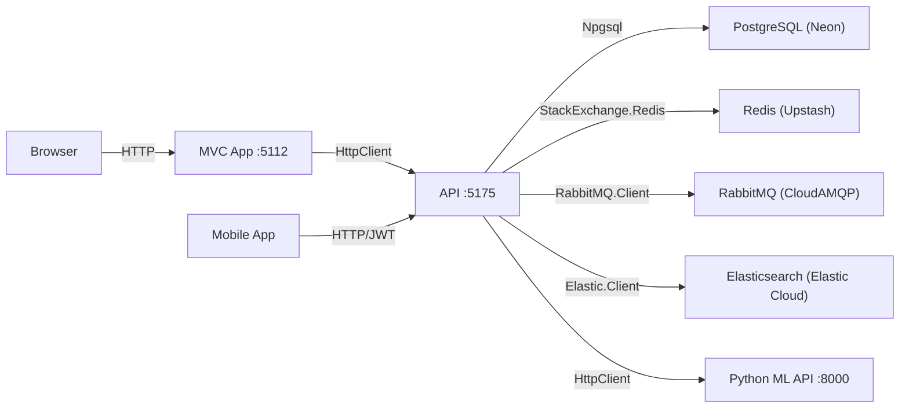
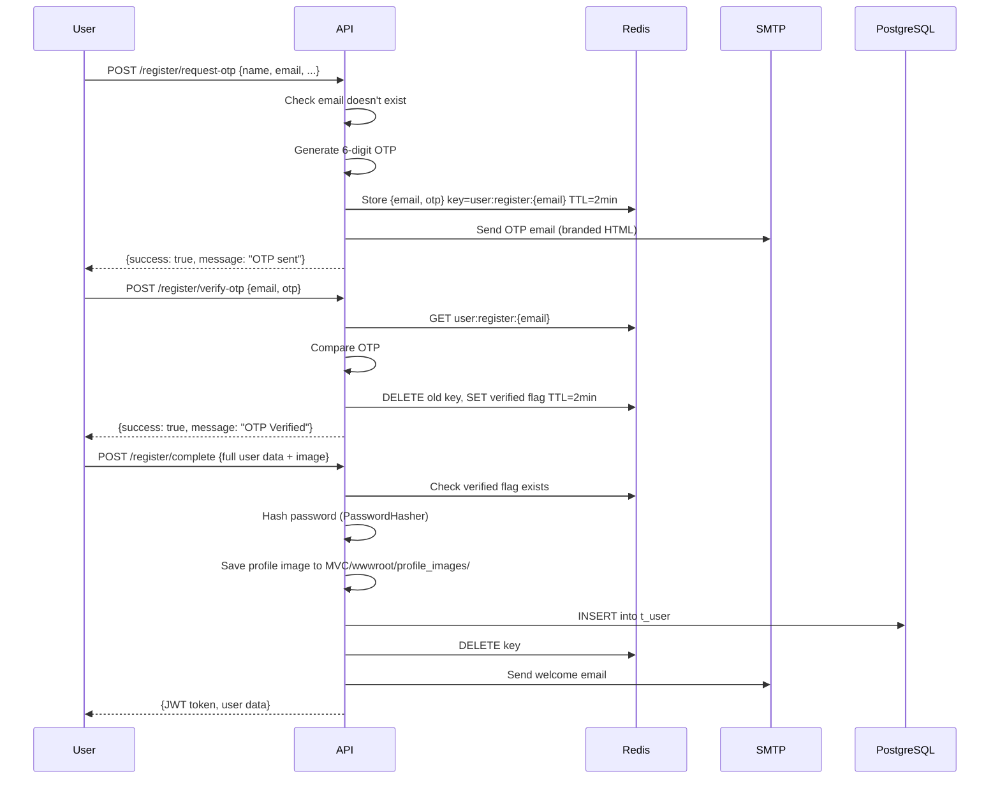
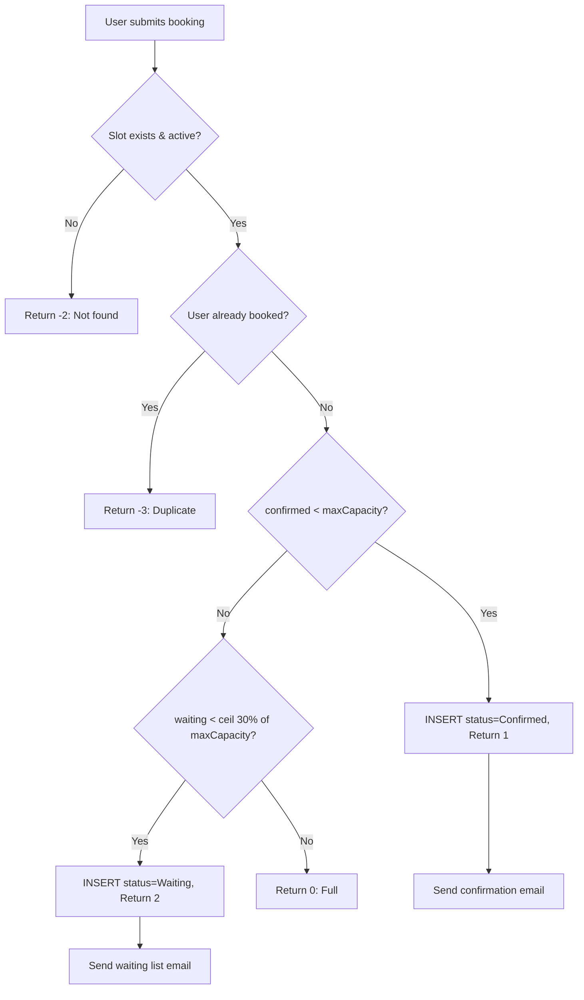

# WellFit — Master Project Report

> **Audit Date:** 2026-04-20  
> **Auditor:** Senior Full-Stack Engineer (Automated Technical Audit)  
> **Codebase Location:** `e:\Wellfit\Wellfit`

---

## Table of Contents

1. [Project Overview](#1-project-overview)
2. [Database Schema & Data Layer](#2-database-schema--data-layer)
3. [Architecture & Design Patterns](#3-architecture--design-patterns)
4. [API Documentation](#4-api-documentation)
5. [Validation & Error Handling](#5-validation--error-handling)
6. [Frontend (MVC)](#6-frontend-mvc)
7. [Feature Flows & Business Logic](#7-feature-flows--business-logic)
8. [Security Implementation](#8-security-implementation)
9. [Constants, Enums & Magic Values](#9-constants-enums--magic-values)
10. [Known Issues & Technical Debt](#10-known-issues--technical-debt)
11. [Dependency Manifest](#11-dependency-manifest)

---

## 1. PROJECT OVERVIEW

### 1.1 Purpose

**WellFit** is a fitness class marketplace and management platform. It connects **Users** (clients) with **Trainers** (coaches), allowing trainers to create and schedule fitness classes, and users to browse, book, and manage their training sessions. An **Admin** panel provides platform governance, trainer verification, and analytics.

### 1.2 Tech Stack

| Layer | Technology | Version |
|---|---|---|
| **Runtime** | .NET | 8.0 |
| **Language** | C# | 12 |
| **Web Framework** | ASP.NET Core (Web API + MVC) | 8.0 |
| **Database** | PostgreSQL (Neon cloud) | via Npgsql 10.0.2 |
| **Search Engine** | Elasticsearch | via Elastic.Clients.Elasticsearch 8.* |
| **Cache / Session** | Redis | via StackExchange.Redis 2.12.8 |
| **Message Queue** | RabbitMQ | via RabbitMQ.Client 7.2.1 |
| **Authentication** | JWT Bearer Tokens | via Microsoft.AspNetCore.Authentication.JwtBearer 8.0.16 |
| **Email** | SMTP (Gmail) | via System.Net.Mail |
| **ML Integration** | External Python API | via HttpClient |
| **API Docs** | Swagger / Swashbuckle | via Swashbuckle.AspNetCore 6.6.2 |
| **Frontend** | ASP.NET MVC + Razor Views | Bootstrap 5 + jQuery + Kendo UI |

### 1.3 Solution Structure

```
WellFit.sln
├── API/                          # REST API project (Web API)
│   ├── Controllers/              # 13 API controllers
│   ├── Helpers/                  # AuthClaimsHelper (JWT claim resolution)
│   ├── Models/                   # API-layer DTOs and request/response models
│   ├── Services/                 # JWT service, Python ML client
│   ├── Properties/               # launchSettings.json
│   ├── Program.cs                # DI container, middleware pipeline
│   ├── appsettings.json          # Connection strings, JWT config
│   └── API.csproj                # Project file
│
├── Repositories/                 # Data access & business services layer
│   ├── Implementations/          # Repository implementations (raw Npgsql)
│   ├── Interfaces/               # Repository and service interfaces
│   ├── Models/                   # Domain models, DTOs, Elastic documents
│   │   └── Elastic/              # Elasticsearch document models
│   ├── Services/                 # Email, Redis, RabbitMQ, Elastic services
│   ├── Templates/                # HTML email templates
│   └── Repositories.csproj       # Project file
│
├── MVC/                          # Server-rendered frontend (MVC)
│   ├── Controllers/              # 5 MVC controllers
│   ├── Models/                   # ViewModels
│   ├── Views/                    # Razor views (Admin, Client, Trainer, User, Home)
│   │   ├── Admin/                # 6 admin views
│   │   ├── Client/               # 9 client views
│   │   ├── Home/                 # 3 home views
│   │   ├── Trainer/              # 14 trainer views
│   │   ├── User/                 # 6 user views
│   │   └── Shared/               # 9 layout files
│   ├── Services/                 # API client services for SSR
│   ├── wwwroot/                  # Static assets (CSS, JS, images)
│   ├── Properties/               # launchSettings.json
│   ├── Program.cs                # MVC bootstrap + cookie auth
│   └── MVC.csproj                # Project file
│
├── API.Tests/                    # Test project (xUnit)
└── .gitignore
```

### 1.4 Environment Variables & Configuration

All configuration is in `appsettings.json` (no `.env` files).

#### API `appsettings.json`

| Key | Purpose | Example Value |
|---|---|---|
| `ConnectionStrings:DefaultConnection` | PostgreSQL connection (Neon) | `Host=ep-xxx.neon.tech;Port=5432;Database=wellfit;Username=...;Password=...;SslMode=Require` |
| `Redis:ConnectionString` | Redis cache/session | `redis-xxx.upstash.io:6379,password=...,ssl=true,abortConnect=false` |
| `RabbitMQ:HostName` | RabbitMQ broker host | `sparrow-xxx.rmq.cloudamqp.com` |
| `RabbitMQ:VirtualHost` | RabbitMQ vhost | `fwcjbtbb` |
| `RabbitMQ:Username` | RabbitMQ username | `fwcjbtbb` |
| `RabbitMQ:Password` | RabbitMQ password | `(redacted)` |
| `RabbitMQ:Port` | RabbitMQ port | `5672` |
| `Elasticsearch:Url` | Elasticsearch endpoint | `https://xxx.es.us-east-1.aws.elastic.cloud:443` |
| `Elasticsearch:ApiKey` | Elasticsearch API key | `(redacted)` |
| `Jwt:Key` | HMAC-SHA256 signing key | `sdfh3KSDJCibd245ko34itABCDEF456789` |
| `Jwt:Issuer` | Token issuer | `http://localhost:5175` |
| `Jwt:Audience` | Token audience | `http://localhost:5112` |
| `Jwt:Subject` | Token subject claim | `WellFitAuth` |
| `Jwt:ExpiryMinutes` | Token TTL | `120` |
| `EmailSettings:SmtpServer` | SMTP host | `smtp.gmail.com` |
| `EmailSettings:Port` | SMTP port | `587` |
| `EmailSettings:SenderName` | Display name for emails | `Wellfit` |
| `EmailSettings:SenderEmail` | Sender email address | `wellfitperformance@gmail.com` |
| `EmailSettings:AppPassword` | Gmail app password | `(redacted)` |
| `PythonMlApi:BaseUrl` | ML prediction service | `http://127.0.0.1:8000` |

#### MVC `appsettings.json`

| Key | Purpose | Example Value |
|---|---|---|
| `ApiSettings:BaseUrl` | Base URL of the API project | `http://localhost:5175/` |
| `Jwt:Key` | Same signing key (for cookie validation) | `sdfh3KSDJCibd245ko34itABCDEF456789` |
| `Jwt:Issuer` | Must match API issuer | `http://localhost:5175` |
| `Jwt:Audience` | Must match API audience | `http://localhost:5112` |

### 1.5 Ports

| Service | Port | URL |
|---|---|---|
| **API** (HTTP) | 5175 | `http://localhost:5175` |
| **API** (HTTPS) | 7280 | `https://localhost:7280` |
| **MVC** (HTTP) | 5112 | `http://localhost:5112` |
| **MVC** (HTTPS) | 7217 | `https://localhost:7217` |
| **Swagger UI** | 5175 | `http://localhost:5175/swagger` |
| **Python ML API** | 8000 | `http://127.0.0.1:8000` |
| **PostgreSQL** | 5432 | Neon cloud |
| **Redis** | 6379 | Upstash cloud |
| **RabbitMQ** | 5672 | CloudAMQP |

### 1.6 How to Run Locally

```bash
# 1. Clone the repo
git clone <repo-url> && cd Wellfit

# 2. Restore dependencies
dotnet restore

# 3. Start the API (terminal 1)
cd API
dotnet run --launch-profile http
# → http://localhost:5175/swagger

# 4. Start the MVC frontend (terminal 2)
cd MVC
dotnet run --launch-profile http
# → http://localhost:5112

# 5. (Optional) Start Python ML API (terminal 3)
cd ml_api
python -m uvicorn main:app --reload
# → http://127.0.0.1:8000
```

> [!IMPORTANT]
> Both API and MVC must run simultaneously. The MVC project proxies all data requests to the API via `HttpClient`.

---

## 2. DATABASE SCHEMA & DATA LAYER

### 2.1 PostgreSQL Tables

The project uses **raw Npgsql SQL** (no EF Core / ORM). Column names use the `c_` prefix convention.

---

#### `t_user` — Core user table (Users, Trainers, Admins)

| Column | DB Column | Type | Constraints | Notes |
|---|---|---|---|---|
| UserId | `c_user_id` | `SERIAL` | PK, auto-increment | — |
| UserName | `c_name` | `VARCHAR(100)` | NOT NULL | — |
| UserEmail | `c_email` | `VARCHAR` | NOT NULL, UNIQUE | Used for login + OTP |
| UserPassword | `c_password` | `VARCHAR(100)` | NOT NULL | Hashed via `PasswordHasher<t_User>` |
| UserGender | `c_gender` | `VARCHAR` | NOT NULL | — |
| UserMobile | `c_mobile` | `VARCHAR(15)` | NOT NULL | 10–15 chars |
| UserRole | `c_role` | `VARCHAR` | DEFAULT `'User'` | `User` / `Trainer` / `Admin` |
| UserImagePath | `c_image` | `VARCHAR` | — | Path to profile image file |
| Status | `c_status` | `VARCHAR` | DEFAULT `'Active'` | `Active` / `InActive` |

---

#### `t_trainer` — Trainer extension table (1:1 with `t_user`)

| Column | DB Column | Type | Constraints | Notes |
|---|---|---|---|---|
| UserId | `c_user_id` | `INT` | FK → `t_user.c_user_id` | 1:1 relationship |
| Specialization | `c_trainer_specializations` | `VARCHAR(100)` | NOT NULL | e.g. "Yoga", "CrossFit" |
| Bio | `c_trainer_bio` | `VARCHAR(300)` | NOT NULL | — |
| Certifications | `c_trainer_certifications` | `JSONB` | NOT NULL | Array of `{CertificationName, CertificationNumber, ExpireDate, DocumentPath}` |
| Adharcard | `c_trainer_adharcard` | `VARCHAR` | NOT NULL | Identity verification |
| Experience | `c_years_of_experience` | `INT` | NOT NULL | Years of experience |
| Followers | `c_follower` | `INT[]` | DEFAULT `'{}'` | PostgreSQL integer array of user IDs |
| Rating | `c_rating_avg` (dynamic) | `DOUBLE` | — | Dynamically resolved column name |

---

#### `t_class` — Fitness class definitions

| Column | DB Column | Type | Constraints | Notes |
|---|---|---|---|---|
| ClassId | `c_class_id` | `SERIAL` | PK | — |
| TrainerId | `c_user_id` | `INT` | FK → `t_user.c_user_id` | Owner trainer |
| ClassTypeId | `c_classtype_id` | `INT` | FK → `t_classtype` | — |
| ClassName | `c_class_name` | `VARCHAR(50)` | NOT NULL | — |
| ClassDescription | `c_class_description` | `VARCHAR(300)` | NOT NULL | — |
| ClassTags | `c_class_tags` | `VARCHAR(200)` | NOT NULL | Comma-separated |
| ClassStatus | `c_class_status` | `VARCHAR(100)` | NOT NULL | `Active` / `InActive` |
| ClassDemoVideo | `c_class_demovideo` | `VARCHAR(200)` | NOT NULL | Video URL |
| ClassBanner | `c_class_banner` | `VARCHAR(200)` | — | Banner image path |

---

#### `t_classtype` — Class category lookup

| Column | DB Column | Type | Constraints |
|---|---|---|---|
| ClassTypeId | `c_classtype_id` | `SERIAL` | PK |
| ClassTypeName | `c_class_type` | `VARCHAR(50)` | NOT NULL |

---

#### `t_scheduler` — Recurring schedule templates for classes

| Column | DB Column | Type | Constraints | Notes |
|---|---|---|---|---|
| SchedulerId | `c_scheduler_id` | `SERIAL` | PK | — |
| ClassId | `c_class_id` | `INT` | FK → `t_class` | — |
| StartDate | `c_start_date` | `DATE` | NOT NULL | — |
| EndDate | `c_end_date` | `DATE` | NOT NULL | ≥ StartDate |
| Status | `c_status` | `VARCHAR(20)` | DEFAULT `'Active'` | — |
| Price | `c_price` | `DECIMAL(10,2)` | DEFAULT `0.00` | — |
| ClassMode | `c_class_mode` | `VARCHAR(20)` | NOT NULL | `Online` / `Offline` |
| ClassLocation | `c_class_location` | `VARCHAR(500)` | — | Physical address |
| ClassLink | `c_class_link` | `VARCHAR(500)` | — | Video call URL |
| MaxCapacity | `c_max_capacity` | `INT` | NOT NULL, > 0 | — |
| StartTime | `c_start_time` | `TIME` | NOT NULL | — |
| EndTime | `c_end_time` | `TIME` | NOT NULL | > StartTime |
| Weekdays | `c_weekdays` | `INT[]` | NOT NULL | 0=Sun … 6=Sat |
| PlatformFeePct | `c_platform_fee_pct` | `DECIMAL(5,2)` | DEFAULT `20.00` | 0–100 |

---

#### `t_classslot` — Individual time-slot instances

| Column | DB Column | Type | Constraints | Notes |
|---|---|---|---|---|
| SlotId | `c_slot_id` | `SERIAL` | PK | — |
| ClassId | `c_class_id` | `INT` | FK → `t_class` | — |
| SchedulerId | `c_scheduler_id` | `INT` | FK → `t_scheduler` | — |
| Date | `c_date` | `DATE` | NOT NULL | — |
| StartTime | `c_start_time` | `TIME` | NOT NULL | — |
| EndTime | `c_end_time` | `TIME` | NOT NULL | — |
| MaxCapacity | `c_max_capacity` | `INT` | NOT NULL, > 0 | — |
| Price | `c_price` | `DECIMAL(10,2)` | DEFAULT `0.00` | — |
| ClassMode | `c_class_mode` | `VARCHAR(20)` | NOT NULL | — |
| ClassLocation | `c_class_location` | `VARCHAR(500)` | — | — |
| ClassLink | `c_class_link` | `VARCHAR(500)` | — | — |
| PlatformFeePct | `c_platform_fee_pct` | `DECIMAL(5,2)` | DEFAULT `20.00` | — |
| Status | `c_status` | `VARCHAR(20)` | DEFAULT `'Active'` | — |

---

#### `t_booking` — User bookings for slots

| Column | DB Column | Type | Constraints | Notes |
|---|---|---|---|---|
| BookingId | `c_booking_id` | `SERIAL` | PK | — |
| UserId | `c_user_id` | `INT` | FK → `t_user` | — |
| SlotId | `c_slot_id` | `INT` | FK → `t_classslot` | — |
| BookingStatus | `c_booking_status` | `VARCHAR(50)` | NOT NULL | `Confirmed` / `Waiting` / `Cancelled` |
| PaymentId | `c_payment_id` | `INT` | — | Optional FK |

---

### 2.2 Elasticsearch Indices

**Index: Classes** — Searchable class catalog with aggregation support.

Key fields: `ClassId`, `TrainerId`, `ClassName`, `ClassDescription`, `ClassTypeName`, `ClassMode`, `Price`, `Rating`, `UpcomingSlotCount`, `TotalBookings`, `NextSlotDate`, `ClassStatus`, `Tags[]`.

**Index: Bookings** — Searchable booking records for dashboards.

Key fields: `BookingId`, `UserId`, `TrainerId`, `ClassId`, `ClassName`, `SlotId`, `SlotDate`, `StartTime`, `EndTime`, `Price`, `PlatformFeePct`, `BookingStatus`, `ClassMode`.

### 2.3 Redis Keys

| Pattern | Purpose | TTL |
|---|---|---|
| `user:register:{email}` | Pending user OTP verification data | 2–10 min |
| `trainer:register:{email}` | Pending trainer OTP verification data | 10 min |
| `trainer:forgot-password:{email}` | Pending password reset OTP | 10 min |

---

## 3. ARCHITECTURE & DESIGN PATTERNS

### 3.1 High-Level Architecture



### 3.2 Layered Architecture

| Layer | Project | Responsibility |
|---|---|---|
| **Presentation** | `MVC` | Razor views, cookie auth, API proxying |
| **API Gateway** | `API` | REST endpoints, JWT auth, request validation |
| **Service / Business Logic** | `Repositories/Services` | Email, queue, search, OTP workflows |
| **Data Access** | `Repositories/Implementations` | Raw SQL via Npgsql |
| **Infrastructure** | External cloud services | PostgreSQL, Redis, RabbitMQ, Elasticsearch |

### 3.3 Key Design Patterns

| Pattern | Where Used |
|---|---|
| **Repository Pattern** | All `I*Interface` + `*Repository` pairs |
| **Dependency Injection** | All services registered in `Program.cs` (scoped/singleton) |
| **Service Layer** | `BookingEmailService`, `UserStatusEmailService`, OTP services |
| **Factory** | `RabbitMqConnectionFactory` for connection lifecycle |
| **Strategy (implicit)** | Dynamic column resolution in `TrainerRepo` |
| **Template Method** | `EmailTemplates` / `EmailTemplateGenerator` for HTML emails |

### 3.4 DI Registration Summary (API `Program.cs`)

```
Scoped:    NpgsqlConnection, IUserInterface, ITrainerInterface,
           IClassInterface, IClassSchedularInterface, IClassSlotInterface,
           IBookingInterface, IUserRegistrationOtpService,
           ITrainerRegistrationOtpService, ILandingPageRepository,
           IBookingEmailService, IUserStatusEmailService

Singleton: IConnectionMultiplexer (Redis), IRabbitMqConnectionFactory,
           ClassElasticServices, BookingElasticServices

Transient: IRedisService, IQueueService

HttpClient: IPythonMlClient (named)

Options:   JwtSettings, t_EmailSettings, RabbitMqOptions
```

---

## 4. API DOCUMENTATION

**Base URL:** `http://localhost:5175/api`

### 4.1 UserApiController — `api/user`

| Method | Route | Auth | Description |
|---|---|---|---|
| `POST` | `/register/request-otp` | ❌ | Sends OTP to user email for registration |
| `POST` | `/register/verify-otp` | ❌ | Verifies OTP, marks session as verified |
| `POST` | `/register/complete` | ❌ | Completes registration after OTP verified |
| `POST` | `/login` | ❌ | Authenticates user, returns JWT |
| `GET` | `/profile/{userId}` | ✅ | Gets user profile |
| `PUT` | `/profile/update` | ✅ | Updates user profile (multipart/form-data) |
| `PUT` | `/change-password` | ✅ | Changes password (current + new) |

### 4.2 TrainerApiController — `api/trainer`

| Method | Route | Auth | Description |
|---|---|---|---|
| `POST` | `/register/request-otp` | ❌ | Sends OTP for trainer registration |
| `POST` | `/register/verify-otp` | ❌ | Verifies trainer OTP |
| `POST` | `/register/complete` | ❌ | Completes trainer registration (multipart with certificates) |
| `POST` | `/login` | ❌ | Authenticates trainer |
| `GET` | `/profile/{trainerId}` | ✅ | Gets trainer profile |
| `PUT` | `/profile/update` | ✅ | Updates trainer profile |
| `PUT` | `/change-password` | ✅ | Changes trainer password |
| `POST` | `/forgot-password/initiate` | ❌ | Initiates password reset OTP |
| `POST` | `/forgot-password/verify-otp` | ❌ | Verifies reset OTP |
| `POST` | `/forgot-password/reset` | ❌ | Resets password after verification |
| `GET` | `/browse` | ❌ | Browse all trainers with follow status |
| `GET` | `/{trainerId}/followers` | ❌ | Get trainer's follower list |
| `GET` | `/{trainerId}/is-following` | ✅ | Check if current user follows trainer |

### 4.3 AdminApiController — `api/admin`

| Method | Route | Auth | Description |
|---|---|---|---|
| `GET` | `/dashboard` | ✅ Admin | Dashboard summary (users, trainers, classes, bookings) |
| `GET` | `/trainers` | ✅ Admin | List all trainers with details |
| `GET` | `/trainers/{trainerId}` | ✅ Admin | Get trainer details + certifications |
| `POST` | `/trainers/{trainerId}/toggle-status` | ✅ Admin | Activate/deactivate trainer + email notification |
| `GET` | `/users` | ✅ Admin | List all users |
| `POST` | `/users/{userId}/toggle-status` | ✅ Admin | Activate/deactivate user + email notification |
| `GET` | `/class-types` | ✅ | List all class types |
| `POST` | `/class-types` | ✅ Admin | Create class type |
| `GET` | `/notifications` | ✅ Admin | Get admin notification queue |
| `GET` | `/revenue` | ✅ Admin | Platform revenue analytics |

### 4.4 ClassController — `api/class`

| Method | Route | Auth | Description |
|---|---|---|---|
| `GET` | `/list` | ❌ | List all classes |
| `GET` | `/details/{classId}` | ❌ | Get class by ID |
| `POST` | `/create` | ✅ | Create class with banner upload |
| `PUT` | `/update/{classId}` | ✅ | Update class (owner only) |
| `DELETE` | `/delete/{classId}` | ✅ | Delete class (owner only) |
| `GET` | `/class-types` | ❌ | List all class types |
| `GET` | `/search` | ❌ | Full-text Elasticsearch search |
| `GET` | `/by-trainer/{trainerId}` | ❌ | Elasticsearch classes by trainer |

### 4.5 ClassSchedularApiController — `api/class-schedular`

| Method | Route | Auth | Description |
|---|---|---|---|
| `GET` | `/list` | ❌ | All schedulers |
| `GET` | `/details/{schedulerId}` | ❌ | Get scheduler by ID |
| `GET` | `/by-class/{classId}` | ❌ | Schedulers for a class |
| `POST` | `/create` | ✅ | Create scheduler (owner only) |
| `PUT` | `/update/{schedulerId}` | ✅ | Update scheduler (owner only) |
| `DELETE` | `/delete/{schedulerId}` | ✅ | Delete scheduler (owner only) |

### 4.6 ClassSlotApiController — `api/classslot`

| Method | Route | Auth | Description |
|---|---|---|---|
| `GET` | `/list` | ❌ | All slots |
| `GET` | `/details/{slotId}` | ❌ | Get slot by ID |
| `GET` | `/by-class/{classId}` | ❌ | Slots for a class |
| `POST` | `/create` | ✅ | Create slot (owner only, publishes to RabbitMQ) |
| `PUT` | `/update/{slotId}` | ✅ | Update slot (owner only) |
| `DELETE` | `/delete/{slotId}` | ✅ | Delete slot (owner only) |

### 4.7 BookingApiController — `api/booking`

| Method | Route | Auth | Description |
|---|---|---|---|
| `GET` | `/list` | ❌ | All bookings |
| `POST` | `/create` | ❌ | Create booking (handles waitlist) + sends email |
| `PUT` | `/cancel/{bookingId}` | ❌ | Cancel booking + auto-promote waitlist + email |

**Booking Result Codes:**

| Code | Meaning |
|---|---|
| `1` | Confirmed booking |
| `2` | Added to waiting list |
| `0` | Full (seats + waitlist) |
| `-2` | Slot not found or inactive |
| `-3` | User already has active booking |

### 4.8 HomeApiController — `api/home`

| Method | Route | Auth | Description |
|---|---|---|---|
| `GET` | `/landing-summary` | ❌ | Landing page data: stats, trending classes, best trainers |

### 4.9 UserDashboardApiController — `api/user-dashboard`

| Method | Route | Auth | Description |
|---|---|---|---|
| `GET` | `/{userId}` | ❌ | User booking dashboard (date-filtered) |
| `GET` | `/{userId}/overview` | ❌ | Dashboard overview + upcoming classes |
| `POST` | `/follow` | ✅ | Follow a trainer |
| `POST` | `/unfollow` | ✅ | Unfollow a trainer |

### 4.10 TrainerDashboardApiController — `api/trainer-dashboard`

| Method | Route | Auth | Description |
|---|---|---|---|
| `GET` | `/me` | ✅ | Trainer's own dashboard (from token) |
| `GET` | `/{trainerId}` | ❌ | Trainer dashboard by ID |

### 4.11 TrainerPortalApiController — `api/trainer-portal`

| Method | Route | Auth | Description |
|---|---|---|---|
| `GET` | `/dashboard/{trainerId}` | ❌ | Comprehensive trainer portal with revenue, bookings, classes, notifications |

### 4.12 UserNotificationApiController — `api/user-notifications`

| Method | Route | Auth | Description |
|---|---|---|---|
| `GET` | `/` | ✅ | Get user's notifications from RabbitMQ |
| `DELETE` | `/remove` | ✅ | Remove specific notification |
| `DELETE` | `/clear` | ✅ | Purge all notifications |

### 4.13 AdminMessageApiController — `api/admin/messages`

| Method | Route | Auth | Description |
|---|---|---|---|
| `GET` | `/` | ✅ Admin | Read admin message queue |

### 4.14 RecommendationController — `api/Recommendation`

| Method | Route | Auth | Description |
|---|---|---|---|
| `POST` | `/predict` | ❌ | ML fitness prediction (BMI, food, exercises, classes) |

### 4.15 TestEmailApiController — `api/TestEmailApi`

| Method | Route | Auth | Description |
|---|---|---|---|
| `POST` | `/send-email` | ❌ | Development email testing endpoint |

---

## 5. VALIDATION & ERROR HANDLING

### 5.1 Model Validation (Data Annotations)

#### User Registration

| Field | Rules |
|---|---|
| `UserName` | Required, max 100 chars |
| `UserEmail` | Required, `[EmailAddress]`, regex: `^[a-zA-Z0-9._%+-]+@[a-zA-Z0-9.-]+\.[a-zA-Z]{2,}$` |
| `UserPassword` | Required, 8–100 chars, regex: uppercase + lowercase + digit + special char |
| `UserConfirmPassword` | Required, must match `UserPassword` |
| `UserGender` | Required |
| `UserMobile` | Required, 10–15 chars |
| `UserImage` | Required (`IFormFile`) |

#### Trainer Registration (extends User)

| Field | Rules |
|---|---|
| `TrainerSpecialization` | Required, max 100 chars |
| `TrainerBio` | Required, max 300 chars |
| `TrainerCertifications` | Required, min 1 item |
| `TrainerAdharcard` | Required |
| `TrainerExperience` | Required (int) |

#### Scheduler Validation (Controller-level)

| Rule | Validation |
|---|---|
| EndDate ≥ StartDate | `if (scheduler.EndDate.Date < scheduler.StartDate.Date)` |
| EndTime > StartTime | `if (scheduler.EndTime <= scheduler.StartTime)` |
| Weekdays non-empty | `if (scheduler.Weekdays.Length == 0)` |
| Weekdays 0-6 | `if (day < 0 \|\| day > 6)` |
| ClassMode valid | Must be `Online` or `Offline` |

### 5.2 Error Response Strategy

All controllers return consistent anonymous JSON objects:
```json
{ "message": "Human-readable error description." }
```

Standard HTTP status codes are used: `200`, `201`, `204`, `400`, `401`, `403`, `404`, `409`, `500`.

---

## 6. FRONTEND (MVC)

### 6.1 MVC Architecture

The MVC project is a **server-side-rendered** frontend that proxies all API calls via `HttpClient`.

**Authentication Flow:**
1. User logs in via MVC → MVC calls API `/login` → gets JWT
2. JWT stored in cookie `WellFit.JwtToken`
3. Cookie authentication middleware validates JWT on every request
4. `ClaimsPrincipal` is replaced with JWT claims on each validation

### 6.2 MVC Controllers

| Controller | Route Prefix | Responsibility |
|---|---|---|
| `HomeController` | `/Home` | Landing page, privacy, recommendation |
| `UserController` | `/User` | Login, register, trainer register, profile |
| `ClientController` | `/Client` | User dashboard, bookings, browse, trainers |
| `TrainerController` | `/Trainer` | Trainer portal, classes, slots, settings |
| `AdminController` | `/Admin` | Admin dashboard, trainer/user management |

### 6.3 View Layouts

| Layout | Used By |
|---|---|
| `_Layout.cshtml` | Default layout |
| `_WellfitLayout.cshtml` | Public pages (landing, auth) |
| `_UserLayout.cshtml` | User dashboard area |
| `_ClientLayout.cshtml` | Client (user) area |
| `_AdminLayout.cshtml` | Admin panel |
| `_TrainerLayout.cshtml` | Trainer registration/auth |
| `_TrainerDashboardLayout.cshtml` | Trainer portal/dashboard |
| `_RLayout.cshtml` | Recommendation page |

### 6.4 Key Views

**Client Views (9):** Dashboard, Bookings, Browse, Trainers, Profile, Notifications, Reviews, Emails, Wishlist

**Trainer Views (14):** Dashboard, MyClasses, CreateClass, EditClass, MySlots, AddSlot, SlotDetails, ClassCalendar, MyProfile, UpdateProfile, ChangePassword, Notifications, PayoutsBilling, Settings, WaitingList

**Admin Views (6):** Dashboard, TrainerManagement, UserManagement, ClassTypes, Revenue, Notifications

### 6.5 Static Assets

| File | Purpose |
|---|---|
| `wwwroot/css/site.css` | Global styles |
| `wwwroot/css/admin.css` | Admin panel theme |
| `wwwroot/css/trainer-dashboard.css` | Trainer portal theme |
| `wwwroot/css/wellfit-theme.css` | WellFit brand theme |
| `wwwroot/js/site.js` | Global JavaScript |
| `wwwroot/js/admin.js` | Admin panel logic |
| `wwwroot/js/trainer-dashboard.js` | Trainer portal logic |
| `wwwroot/lib/bootstrap/` | Bootstrap 5 |
| `wwwroot/lib/jquery/` | jQuery |
| `wwwroot/lib/kendo/` | Kendo UI |

---

## 7. FEATURE FLOWS & BUSINESS LOGIC

### 7.1 User Registration (OTP Flow)



### 7.2 Trainer Registration (Extended OTP Flow)

Same as user registration but:  
- Inserts into both `t_user` (role=`Trainer`, status=`InActive`) and `t_trainer`
- Certificate PDFs saved to `MVC/wwwroot/trainer_certifications/`
- Certification data stored as JSONB in PostgreSQL
- Sends "Pending Approval" email instead of welcome email
- Admin must manually activate via toggle-status endpoint

### 7.3 Booking System (with Waiting List)



**Cancellation with Auto-Promotion:**
1. Mark booking as `Cancelled`
2. If cancelled booking was `Confirmed`, promote first `Waiting` booking to `Confirmed`
3. Row-level locking with `FOR UPDATE SKIP LOCKED`
4. Entire operation runs in a DB transaction

### 7.4 Trainer Follow/Unfollow System

- Followers stored as PostgreSQL `INT[]` array on `t_trainer.c_follower`
- `array_append()` for follow, `array_remove()` for unfollow
- `array_position()` to check existing follow
- Cardinality used for follower count

### 7.5 Notification System (RabbitMQ)

| Queue Name | Producer | Consumer |
|---|---|---|
| `Admin` | Class creation, slot creation | Admin dashboard |
| `user-notifications-{userId}` | Class/slot creation for followed trainers | User notification panel |

**Pattern:** When a trainer creates a new class or slot, the system:
1. Fetches all followers from `t_trainer.c_follower`
2. Publishes a JSON message to each follower's queue
3. Publishes a summary to the `Admin` queue

**Read Pattern:** Non-destructive read — messages are ACK'd then re-published.

### 7.6 ML Recommendation Engine

| Input | Output |
|---|---|
| Age, Gender, WeightKg, HeightCm, DietaryPreference | BMI calculation + category, recommended foods, exercises, and classes with match scores |

Proxied to Python FastAPI service at `http://127.0.0.1:8000/predict`.

### 7.7 Elasticsearch Integration

**Class Search:** Full-text search across `ClassName`, `ClassDescription`, `Tags`, `ClassTypeName` with filters for `ClassStatus`, `ClassMode`, `TrainerId`, price range, and sorting by `rating`, `price`, `bookings`.

**Dashboard Aggregations:**
- Trainer: Total classes, active/inactive/featured, upcoming slots, bookings by status, revenue, platform fees
- User: Total bookings, upcoming bookings, booking history

### 7.8 Email Templates

| Template | Trigger |
|---|---|
| `BuildOtpEmail` | OTP verification during registration |
| `BuildWelcomeEmail` | Successful user registration |
| `BuildRegistrationSuccessfulEmail` | Alternative welcome template |
| `BuildTrainerRegistrationPendingEmail` | Trainer pending approval |
| `BuildPasswordResetSuccessEmail` | After password change |
| `BookingConfirmed` (generator) | Booking confirmation |
| `BookingCancelled` (generator) | Booking cancellation |
| `AccountActive` (generator) | Account activation by admin |
| `AccountInactive` (generator) | Account deactivation by admin |
| Waiting list (inline HTML) | Added to waiting list |

All emails are dark-themed branded HTML with WellFit gradient styling and Cloudinary-hosted logo.

---

## 8. SECURITY IMPLEMENTATION

### 8.1 Authentication

| Mechanism | Details |
|---|---|
| **JWT Generation** | HMAC-SHA256 (`SecurityAlgorithms.HmacSha256`) |
| **Token Lifetime** | 120 minutes |
| **Claims** | `sub`, `jti`, `email`, `ClaimTypes.Email`, `ClaimTypes.NameIdentifier`, `ClaimTypes.Name`, `ClaimTypes.Role` |
| **Validation** | Issuer, Audience, Lifetime, Signing Key validated |
| **Clock Skew** | `TimeSpan.Zero` (no tolerance) |

### 8.2 Password Security

| Aspect | Implementation |
|---|---|
| **Hashing** | `PasswordHasher<t_User>` (ASP.NET Identity, PBKDF2) |
| **Verification** | `PasswordHasher.VerifyHashedPassword()` |
| **Policy** | Min 8 chars, 1 uppercase, 1 lowercase, 1 digit, 1 special char |

### 8.3 CORS Policy

```csharp
policy.AllowAnyOrigin()
      .AllowAnyMethod()
      .AllowAnyHeader();
```

> [!WARNING]
> CORS allows ALL origins. This must be restricted in production.

### 8.4 Authorization

| Level | Implementation |
|---|---|
| **Route-level** | `[Authorize]` attribute |
| **Role-based** | `[Authorize(Roles = "Admin")]` |
| **Resource-level** | Ownership verified by comparing `trainerId` from JWT with `class.TrainerId` |

### 8.5 OTP Security

| Aspect | Details |
|---|---|
| **Generation** | `RandomNumberGenerator.GetInt32(100000, 1000000)` — cryptographically secure |
| **Storage** | Redis with TTL (2–10 minutes) |
| **Single-use** | Deleted from Redis after verification |

### 8.6 File Upload Security

- Profile images: Saved to `MVC/wwwroot/profile_images/{userId}_{timestamp}{ext}`
- Class banners: Saved to `MVC/wwwroot/class_banners/{classId}_{timestamp}{ext}`
- Certifications: Saved to `MVC/wwwroot/trainer_certifications/{userId}_{certName}_{timestamp}{ext}`

> [!WARNING]
> No file type validation is performed. Any file extension is accepted. This is a security risk.

### 8.7 SQL Injection Protection

All queries use **parameterized queries** (`@parameterName`) via Npgsql — no string concatenation for user input.

### 8.8 Cookie Configuration (MVC)

| Setting | Value |
|---|---|
| Cookie Name | `WellFit.Auth` |
| HttpOnly | `true` |
| SlidingExpiration | `false` |
| JWT Cookie Name | `WellFit.JwtToken` |

---

## 9. CONSTANTS, ENUMS & MAGIC VALUES

### 9.1 User Roles

| Value | Meaning |
|---|---|
| `"User"` | Regular client user |
| `"Trainer"` | Fitness trainer |
| `"Admin"` | Platform administrator |

### 9.2 Status Values

| Entity | Active | Inactive |
|---|---|---|
| User / Trainer | `"Active"` | `"InActive"` |
| Class | `"Active"` | `"InActive"` |
| Scheduler | `"Active"` | — |
| Slot | `"Active"` | — |

### 9.3 Booking Statuses

| Value | Meaning |
|---|---|
| `"Confirmed"` | Active confirmed booking |
| `"Waiting"` | On waiting list |
| `"Cancelled"` | Cancelled |

### 9.4 Class Modes

| Value | Meaning |
|---|---|
| `"Online"` | Virtual class (link required) |
| `"Offline"` | In-person class (location required) |

### 9.5 Business Constants

| Constant | Value | Location |
|---|---|---|
| Waiting list capacity | 30% of max capacity (ceiling) | `BookingRepository` |
| OTP expiry (user) | 2 minutes | `UserRegistrationOtpService` |
| OTP expiry (trainer) | 10 minutes | `TrainerRegistrationOtpService` |
| Verified session TTL | 2–10 minutes | OTP services |
| JWT expiry | 120 minutes | `appsettings.json` |
| Default platform fee | 20% | `t_Scheduler`, `t_ClassSlot` |
| Max landing page classes | 12 (clamped) | `HomeApiController` |
| Max landing page trainers | 12 (clamped) | `HomeApiController` |

### 9.6 RabbitMQ Queue Names

| Queue | Pattern |
|---|---|
| `Admin` | Single admin queue |
| `user-notifications-{userId}` | Per-user notification queues |

### 9.7 Redis Key Patterns

| Pattern | Usage |
|---|---|
| `user:register:{email}` | User registration OTP |
| `trainer:register:{email}` | Trainer registration OTP |
| `trainer:forgot-password:{email}` | Password reset OTP |

---

## 10. KNOWN ISSUES & TECHNICAL DEBT

### 10.1 Critical Security Issues

> [!CAUTION]
> 1. **CORS allows all origins** (`AllowAnyOrigin`). Must be restricted in production.
> 2. **JWT secret key is hardcoded** in `appsettings.json` and is weak (34 chars). Should use a strong key from secrets manager.
> 3. **No file type/size validation** on uploads. Arbitrary files can be uploaded.
> 4. **Sensitive credentials in source** — All connection strings, passwords, and API keys are committed to Git.
> 5. **Some booking endpoints lack `[Authorize]`** — `POST /booking/create` and `PUT /booking/cancel` have no auth.

### 10.2 Architecture Issues

> [!WARNING]
> 1. **Connection management anti-pattern** — All repositories call `_conn.CloseAsync()` then `_conn.OpenAsync()` at the start of every method. This fights against connection pooling and can cause race conditions with scoped connections.
> 2. **AdminApiController bypasses repository pattern** — Uses direct `NpgsqlConnection` instead of repository interfaces for admin queries.
> 3. **TrainerPortalApiController directly accesses `TrainerRepo._conn`** — The `_conn` field is `public` and accessed directly, violating encapsulation.
> 4. **No ORM** — All database access is raw SQL, increasing maintenance burden and risk of mapping errors.
> 5. **Duplicate `GetUserIdAsync` method** — Identical JWT claim resolution logic is copy-pasted in `UserDashboardApiController`, `UserNotificationApiController`, and exists as `AuthClaimsHelper.ResolveUserIdAsync`.

### 10.3 Code Quality

> [!NOTE]
> 1. **Large commented-out code blocks** in `UserRegistrationOtpService` and `TrainerRegistrationOtpService` — dead code from a previous implementation.
> 2. **Inconsistent namespaces** — `api.controller`, `MyApp.Namespace`, `Api.Controllers`, `Api.Services` used across different files.
> 3. **Console.WriteLine used for logging** in repositories instead of `ILogger<T>`.
> 4. **`Class1.cs`** exists in Repositories root — empty/unused file.
> 5. **Debug statements in production code** — `UpdateUserProfile` has `Console.WriteLine($"[DEBUG] ...")` statements.
> 6. **No unit test coverage** — `API.Tests` project exists but test content not verified.
> 7. **Dynamic column resolution** in `TrainerRepo.GetBrowseTrainersAsync()` queries `information_schema.columns` on every request — should be cached.

### 10.4 Missing Features

1. **No rate limiting** on any endpoint
2. **No pagination** on list endpoints (`GetAllBookings`, `GetAllClasses`)
3. **No refresh token** mechanism — only access token
4. **No password reset** flow for regular users (only trainers have forgot-password)
5. **No soft delete** — classes are hard-deleted
6. **No audit logging**
7. **No HTTPS enforcement** in development
8. **Hardcoded URLs** in email templates (e.g., `http://localhost:5112/User/Login`)

---

## 11. DEPENDENCY MANIFEST

### 11.1 API Project (`API.csproj`)

| Package | Version | Purpose |
|---|---|---|
| `Microsoft.AspNetCore.Authentication.JwtBearer` | 8.0.16 | JWT authentication middleware |
| `Swashbuckle.AspNetCore` | 6.6.2 | Swagger/OpenAPI documentation |

### 11.2 Repositories Project (`Repositories.csproj`)

| Package | Version | Purpose |
|---|---|---|
| `Npgsql` | 10.0.2 | PostgreSQL ADO.NET driver |
| `StackExchange.Redis` | 2.12.8 | Redis client |
| `Microsoft.Extensions.Caching.StackExchangeRedis` | 10.0.5 | Redis caching extensions |
| `RabbitMQ.Client` | 7.2.1 | RabbitMQ AMQP client |
| `Elastic.Clients.Elasticsearch` | 8.* | Elasticsearch .NET client |
| `Microsoft.AspNetCore` | 2.3.9 | ASP.NET Core shared framework |
| `Microsoft.Extensions.Configuration.Abstractions` | 10.0.5 | Configuration interfaces |
| `Microsoft.Extensions.Configuration.Json` | 10.0.5 | JSON config file reader |

### 11.3 MVC Project (`MVC.csproj`)

| Package | Version | Purpose |
|---|---|---|
| `Microsoft.IdentityModel.Tokens` | 8.17.0 | Token validation primitives |
| `System.IdentityModel.Tokens.Jwt` | 8.17.0 | JWT handler for cookie auth |

### 11.4 Frontend Libraries (wwwroot/lib)

| Library | Version | Purpose |
|---|---|---|
| Bootstrap | 5.x | CSS framework |
| jQuery | 3.x | DOM manipulation |
| jQuery Validation | — | Client-side form validation |
| jQuery Validation Unobtrusive | — | MVC model validation bridge |
| Kendo UI | — | Advanced UI components (charts, grids) |

### 11.5 External Services

| Service | Provider | Purpose |
|---|---|---|
| PostgreSQL | Neon (`ep-xxx.neon.tech`) | Primary database |
| Redis | Upstash (`redis-xxx.upstash.io`) | OTP session cache |
| RabbitMQ | CloudAMQP (`sparrow-xxx.rmq.cloudamqp.com`) | Message queue for notifications |
| Elasticsearch | Elastic Cloud (`xxx.es.us-east-1.aws.elastic.cloud`) | Full-text search + analytics |
| SMTP | Gmail (`smtp.gmail.com:587`) | Transactional emails |
| Logo | Cloudinary (`res.cloudinary.com`) | Email logo hosting |
| ML API | Self-hosted Python FastAPI (`127.0.0.1:8000`) | BMI/fitness predictions |

---

> **End of Master Project Report**  
> This report documents the complete WellFit codebase as of 2026-04-20. Every controller, model, service, repository, and configuration file has been audited and cataloged.
